# SpectralVisionCrossAttention 模型架构图

> 将以下 Mermaid 代码复制到支持 Mermaid 的编辑器中即可查看渲染效果
> VSCode 用户：安装 "Markdown Preview Mermaid Support" 插件后可直接预览

---

## 完整架构图

```mermaid
graph TB
    %% 样式定义
    classDef input fill:#f0f0f0,stroke:#666,stroke-width:1.5,color:#333,font-size:13px
    classDef spectral fill:#dceaf5,stroke:#2980b9,stroke-width:1.5,color:#1a5276,font-size:12px
    classDef vision fill:#d5f5e3,stroke:#27ae60,stroke-width:1.5,color:#1e8449,font-size:12px
    classDef attention fill:#fef9e7,stroke:#d35400,stroke-width:2,color:#a04000,font-size:13px
    classDef attnStep fill:#fff,stroke:#e67e22,stroke-width:1,color:#333,font-size:11px
    classDef pool fill:#fdedec,stroke:#e74c3c,stroke-width:1.5,color:#fff,font-size:12px
    classDef output fill:#f39c12,stroke:#d35400,stroke-width:2,color:#7b241c,font-size:13px
    classDef qkv fill:#eaf2f8,stroke:#2980b9,stroke-width:1,color:#1a5276,font-size:11px

    subgraph Input["输入层"]
        spec_in["近红外光谱 1600维 → 40x40灰度图<br/>[B, 1, 40, 40]"]:::input
        vis_in["RGB图像 224x224x3<br/>[B, 3, 224, 224]"]:::input
    end

    subgraph Spectral["光谱分支 (EfficientNet-Micro) → Q"]
        s_stem["Stem: Conv2d(1→32, 3x3, s=1) + BN + SiLU<br/>[B, 32, 40, 40]"]:::spectral
        s1["Stage1: MBConv1(3x3, s=1) x1<br/>[B, 16, 40, 40]"]:::spectral
        s2["Stage2: MBConv6(3x3, s=2) x2<br/>[B, 24, 20, 20]"]:::spectral
        s3["Stage3: MBConv6(5x5, s=2) x2<br/>[B, 40, 10, 10]"]:::spectral
        s4["Stage4: MBConv6(3x3, s=2) x3<br/>[B, 80, 5, 5]"]:::spectral
        s_map["映射: Conv2d(80→256, 1x1)<br/>[B, 256, 5, 5]"]:::spectral
        s_tok["Token化: 5x5 → 25个token<br/>[B, 25, 256]"]:::qkv
    end

    subgraph Vision["视觉分支 (ResNet-18 + SPP) → K, V"]
        v_conv1["Conv1: Conv2d(3→64, 7x7, s=2) + BN + ReLU<br/>[B, 64, 112, 112]"]:::vision
        v_pool["MaxPool2d(3x3, s=2, p=1)<br/>[B, 64, 56, 56]"]:::vision
        v_l1["Layer1: ResBlock x2 (64→64, s=1)<br/>[B, 64, 56, 56]"]:::vision
        v_l2["Layer2: ResBlock x2 (64→128, s=2)<br/>[B, 128, 28, 28]"]:::vision
        v_l3["Layer3: ResBlock x2 (128→256, s=2)<br/>[B, 256, 14, 14]"]:::vision
        v_spp["SPP模块: 5x5 + 9x9 + 13x13 三路MaxPool<br/>Concat [B,1024] → Conv1x1(1024→256)<br/>[B, 256, 14, 14]"]:::vision
        v_tok["Token化: 14x14 → 196个token<br/>[B, 196, 256]"]:::qkv
    end

    %% 数据流 - 光谱分支
    spec_in --> s_stem --> s1 --> s2 --> s3 --> s4 --> s_map --> s_tok

    %% 数据流 - 视觉分支
    vis_in --> v_conv1 --> v_pool --> v_l1 --> v_l2 --> v_l3 --> v_spp --> v_tok

    %% ==================== 交叉注意力 ====================
    subgraph CrossAttention["交叉注意力详细计算流程 (Cross-Attention)"]
        direction TB
        
        step1["Step 1: Q/K/V 线性投影"]:::attnStep
        step2["Step 2: 多头拆分 n_heads=4, d_head=64"]:::attnStep
        step3["Step 3: 缩放点积注意力 Q x K^T / sqrt(64)"]:::attnStep
        step4["Step 4: Softmax 归一化"]:::attnStep
        step5["Step 5: 加权聚合 V"]:::attnStep
        step6["Step 6: 输出投影 + 残差 + LayerNorm"]:::attnStep

        step1 --> step2 --> step3 --> step4 --> step5 --> step6
    end

    %% 注意力内部细节
    subgraph AttnDetail["[注意力内部矩阵运算]"]
        d1["Q [B,4,25,64] x K^T [B,4,64,196]"]:::attnStep
        d2["= Score [B,4,25,196] / sqrt(64)"]:::attnStep
        d3["Softmax → Attn_Weights [B,4,25,196]"]:::attnStep
        d4["Attn x V [B,4,196,64] → Head_Out [B,4,25,64]"]:::attnStep
        d5["4头拼接 → [B, 25, 256]"]:::attnStep
    end

    %% 注意力输出
    step6 --> d1 --> d2 --> d3 --> d4 --> d5

    %% 连接分支到注意力
    s_tok -.-> |"Q (查询): 25个光谱token"| step1
    v_tok -.-> |"K, V (键值): 196个图像token"| step1

    %% ==================== 池化与分类 ====================
    d5 --> pool_gap

    subgraph Classifier["池化与分类头"]
        pool_gap["全局平均池化 GAP<br/>mean(dim=1) → [B, 256]"]:::pool
        fc1["FC1: Linear(256→128) + GELU + Dropout(0.1)<br/>[B, 128]"]:::pool
        fc2["FC2: Linear(128→3)<br/>[B, 3]"]:::pool
        out["分类结果: 棉 / 涤纶 / 混纺"]:::output
        pool_gap --> fc1 --> fc2 --> out
    end

    %% 标注Q/K/V角色
    label_q["Q (查询) 来自光谱分支<br/>25个token主动查询<br/>图像中的相关特征"]:::qkv
    label_kv["K, V (键/值) 来自视觉分支<br/>196个token提供<br/>被查询并加权聚合的内容"]:::qkv

    s_tok -.-> label_q
    v_tok -.-> label_kv
```

---

## 使用说明

| 平台 | 操作方式 |
|------|---------|
| **VSCode** | 安装插件 `Markdown Preview Mermaid Support`，打开此文件按 `Ctrl+Shift+V` 预览 |
| **GitHub** | 直接在 `.md` 文件中使用，GitHub 原生支持 Mermaid 渲染 |
| **GitLab** | 同样原生支持 Mermaid |
| **Notion** | 使用 `/mermaid` 命令插入代码块 |
| **在线工具** | 访问 [Mermaid Live Editor](https://mermaid.live/) 粘贴代码 |

---

## 关键数据流总结

| 步骤 | 模块 | 输入 → 输出 | 说明 |
|------|------|------------|------|
| ① | 光谱EfficientNet | [B,1,40,40] → [B,80,5,5] | 4阶段MBConv下采样 |
| ② | 光谱通道映射 | [B,80,5,5] → [B,256,5,5] | 1x1卷积升维到d_model |
| ③ | 光谱Token化 | [B,256,5,5] → **[B,25,256] → Q** | 25个光谱token |
| ④ | 视觉ResNet-18+SPP | [B,3,224,224] → [B,256,14,14] | 到layer3+SPP |
| ⑤ | 视觉Token化 | [B,256,14,14] → **[B,196,256] → K,V** | 196个图像token |
| ⑥ | **交叉注意力** | Q(25) × K(196) → V加权 **→ [B,25,256]** | 4头缩放点积注意力 |
| ⑦ | 全局平均池化 | [B,25,256] → [B,256] | 25个token取均值 |
| ⑧ | MLP分类头 | [B,256] → [B,128] → **[B,3]** | 256→128→3类 |

> 总参数量: ≈12.2M